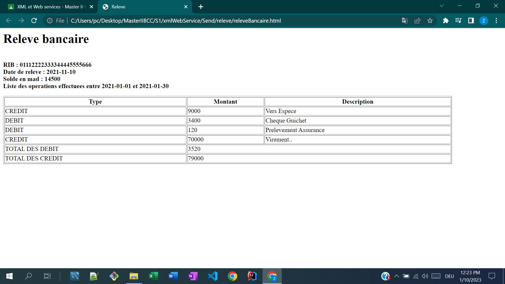

<!DOCTYPE html>
<html lang="en">
<head>
    <meta charset="UTF-8">
    <title>Document</title>
</head>
<body>
    <h1>Compte rendu Releve</h1>

    <h2>relevePart1</h2>
    

    <h2>relevePart2</h2>
    

    <h2>ClientPart3</h2>
    

</body>
</html>

